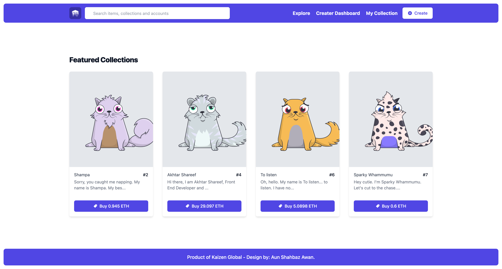
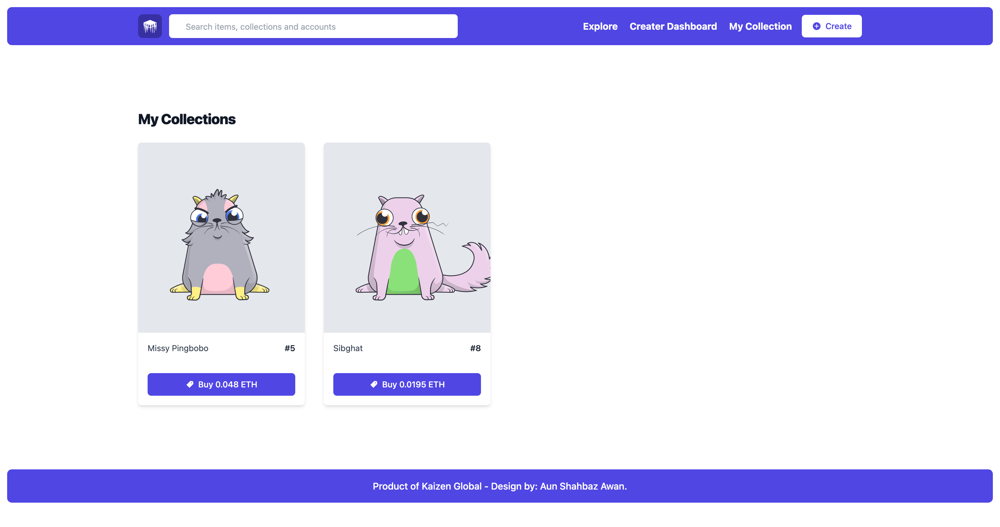
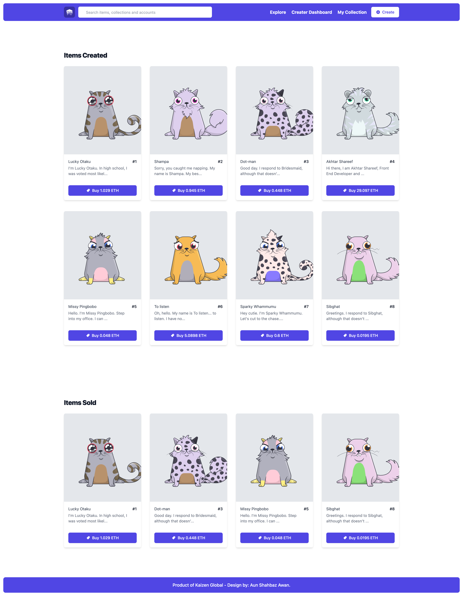
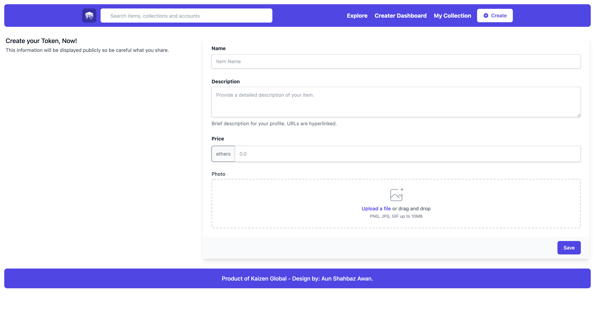

# Building a NFT Marketplace with Next.js, Tailwind, Solidity, Hardhat, Ethers.js, Infura and IPFS - Moralis



### Prerequisites:
#### To be successful in this guide, you must have the following:

1. Node.js installed on your machine
2. Metamask wallet extension installed as a browser extension

## The Stack
#### We will built full stack application using:
- Web application Framework - **[Next.js](https://nextjs.org/)**
- Solidity development environment - **[Hardhat](https://hardhat.org/)**
- IPFS File Storage - **[Moralis](https://moralis.io/)**
- Ethereum Web Client Library - **[Ethers.js](https://docs.ethers.io/v5/)**
- Hosting Servies - **[Infura](http://infura.io/)** (use any Ropsten, Rinkeby, Goerli Testnet)

## Setup Project
```sh 
git clone https://github.com/Aun-Shahbaz-Awan/NFT-Marketplace-with-Hardhat-and-NextJs.git 
```
```sh 
cd NFT-Marketplace-with-Hardhat-and-NextJs 
```
Install node modules by running this command
```sh 
npm install 
```

### Setting up Tailwind CSS
Next, install the Tailwind dependencies:

```sh 
npm install -D tailwindcss@latest postcss@latest autoprefixer@latest 
```
Next, we will create the configuration files needed for Tailwind to work with Next.js (```tailwind.config.js``` and ```postcss.config.js```) by running the following command:

```sh 
npx tailwindcss init -p 
```
Finally, delete the code in styles/globals.css and update it with the following:
```sh
@tailwind base;
@tailwind components;
@tailwind utilities;
```

### Configuring Hardhat
Next, initialize a new Hardhat development environment from the root of your project:
```sh
npx hardhat

? What do you want to do? Create a sample project
? Hardhat project root: <Choose default path>
```
Now you should see the following files and folders created for you in your root directory:

**hardhat.config.js** - The entirety of your Hardhat setup (i.e. your config, plugins, and custom tasks) is contained in this file.
**scripts** - A folder containing a script named sample-script.js that will deploy your smart contract when executed
**test** - A folder containing an example testing script
**contracts** - A folder holding an example Solidity smart contract
Next, update the configuration at **hardhat.config.js** with the following:

> Be sure to never commit any private keys to Git. To be extra safe, consider storing these values in temporary environment variables when working with wallets that contain real tokens. To omit from Git, add .secret to your .gitignore file.
To run the test, run ```npx hardhat test``` from your command line:
```sh
npx hardhat test
```
### Delpoy on Infura - Rinkeby
If test Pass Successfully, Deploy smart contract on Infura using testnet
```sh
npx hardhat run scripts/deploy.js --network rinkeby
```
I used rinkeby, you can use any testnet i.e. ```Ropsten```, ```Rinkeby```, ```Goerli```, ```Kovan``` Testnet

### Running the app
To start the app, run the following command in your CLI:
```sh
npm run dev
```
## Screenshots
### My Collection

### Creater Dashboard

### Create or Mint NFT

Note: This is ERC721 Token.

